__Introduction to Conversational Threading Word2vec with__

Parent Child \(R\)	          OP\-Level  \(R\)	                     Parent Child \(G\)                 OP\-Level  \(G\)

Word2Vec can detect a conversation when it is on discussion

Google News Corpus tends to underestimate the similarity of text

Google Corpus fares worse with comment chains where it largely follows around jokes

Reddit Corpus CAN detect jokes

Also good with finding meaning of the text

Potentially can signal if subreddits are less strict with the moderation with comments going off topic

Noticeable clusters of Discussions and jokes comments in a chain

can see comments where discussion goes off topic from original conversation\)

Based on research on detecting Dark Triad Traits with ML models\, Main goal was to see if machines can detect conversations between different users

Word2Vec is an unsupervised learning model that takes words makes it a vector\.

Google News Model is the base model

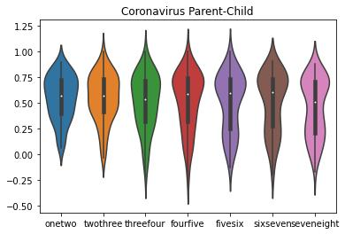

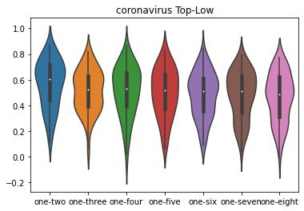

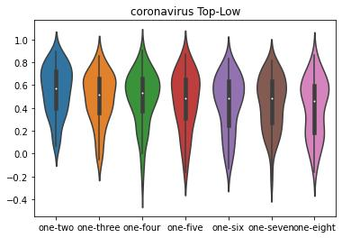

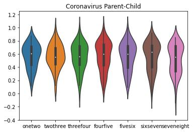

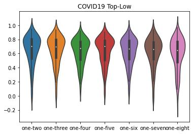

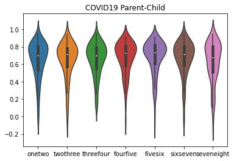

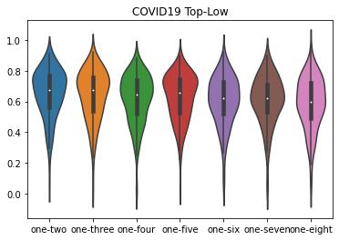

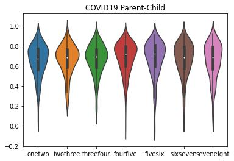

Questions to ask

Can machines effectively detect conversations and relate similarity between each other

Can you see based on conversations if a subreddit is poorly moderated

Do different spaces affect the similarities between threads

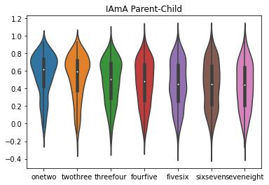

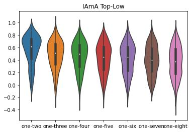

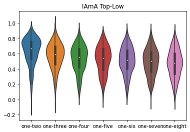

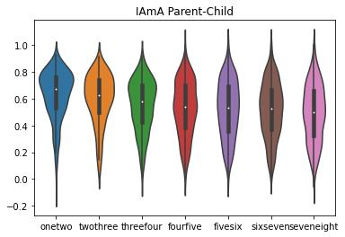

Questions to ask

Reddit Dataset was kind of small\. Some subreddits are very small and didn’t have the required 8 comment chain

Reddit corpus is not as large as the google news corpus\, simply due to limitations of training computer and minimal RAM

Gathered the top posts from six subreddits and took a comment chain of 8 from each post

Coronavirus

COVID19

IAmA

UnethicalLifeProTips

Machine Learning

Learn Machine Learning

Created a word2vec model with 6 million comments from November 2019

Computed the cosine distance with the Google News Corpus and Reddit Corpus

Top comment chain\, next level chain

Parent reply down the chain

Showed the results on a Violin Plot

Reddit Word2Vec space denoted as R

Google News Word2vec space denoted as G

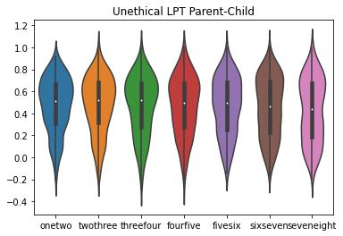

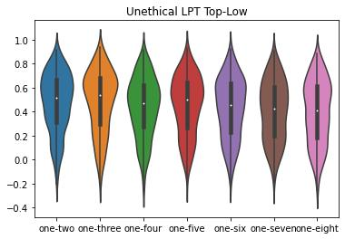

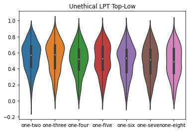

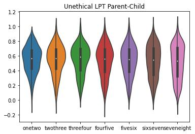

Detecting when comments start veering off\-topics

Seeing when jokes come from the meaning of text

Gaining meaning from the text

Applications to help keep debates on topic

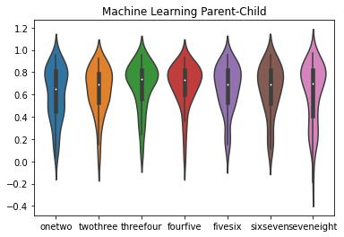

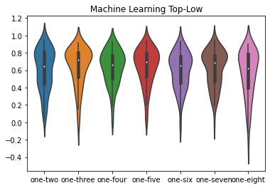

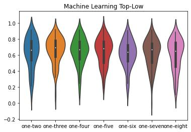

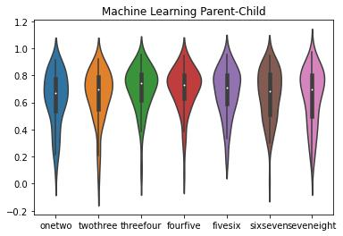

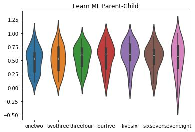

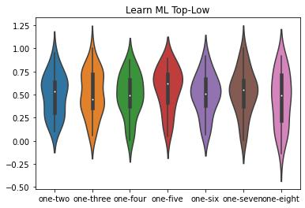

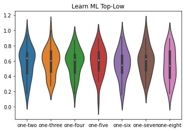

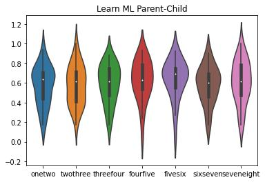

